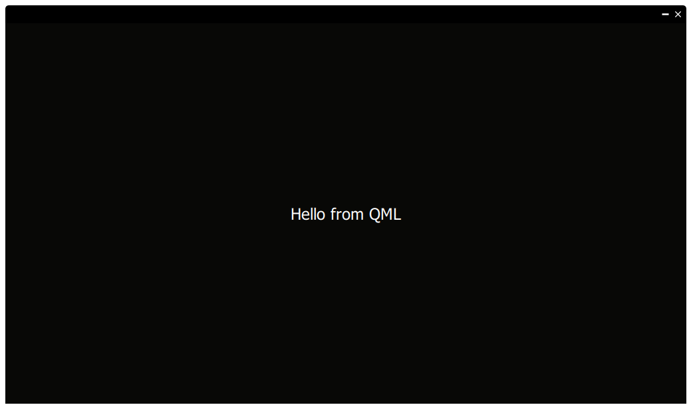

# goqmlframeless
[](https://goreportcard.com/report/github.com/nokka/goqmlframeless)
[](https://godoc.org/github.com/nokka/goqmlframeless)



This package contains a minimalistic QT frameless window using QML for drawing the application. The window disables Windows features such as aerosnap.

### Build the example locally
```sh
$ qtdeploy build
```

### Build the example on windows
```sh
$ qtdeploy -docker build windows_64_shared
```

#### Original author
This package is a modification and adaption of [akiyosi/goqtframelesswindow](https://github.com/akiyosi/goqtframelesswindow), full credit goes to him and his efforts. The reason this package was created was to simplify things and make it more minimalistic. While also using QML to render the application.